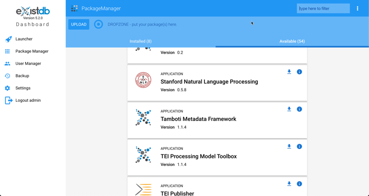

# exist-stanford-nlp

[](https://travis-ci.com/duncdrum/exist-stanford-nlp)

## Introduction
This application is a wrapper around the [Stanford CoreNLP](https://stanfordnlp.github.io/CoreNLP/) pipeline for
[eXist-db](https://www.exist-db.org)

### Why
Loren was between projects and at an eXist-db weekly conference call it
came to light that the previous implementations of Stanford NLP and Named
Entity Recognition were not compatible with version 5.x of eXist-db.
Loren took this project on while looking for the next project, so please
see the contributions section at the end of this article.

## Requirements
-   eXist-db: `5.0.0` with min `4Gb` memory

### For Building from Source
-   maven: `3.6.0`
-   java: `8`
-   (node: `12`)
-   (polymer-cli: `1.9.11`)

## Building from Source
All dependencies including node.js and polymer dependencies are managed by maven. Simply, run `mvn clean package` to generate a `.xar` file inside the `target/` directory. Then follow the installation instructions below.

When developing web-components you can navigate to the `src/main/polymer` directory and execute polymer-cli commands.

For more information see the [polymer readme](./src/main/polymer/README.md)

### Testing
To run unit tests(java, xquery, web-component) locally use: `mvn test`.

Support for integration tests, namely, [Web Component Tester](https://polymer-library.polymer-project.org/3.0/docs/tools/tests) is TBD.

## Installing the Application
1.  Open the eXist-db Dashboard

2.  Login as the administrator

3.  Select ***Stanford Natural Language Processing***

    

### Loading Languages
The application is installed without language files OOTB. The
files need to be loaded after installation. Click on the Setup tab
and then click on the language(s) that you want to load.

When a language is loaded, then there is a checkmark in the button.

### Properties
The properties files within the JAR file are transformed to JSON
documents where the entries pointing to the data files that have been
loaded into the database are transformed to the URL to that resource.

#### Defaults
The pipeline uses default properties that assume that the english jar
file is loaded in the classpath. Since the english jar is loaded into
the database it is important to have a defaults JSON document that
points to the english files in the database.

The defaults are loaded into
`/db/apps/stanford-nlp/data/StanfordCoreNLP-english.json`

## User Interface

### Named Entity Recognition
This user interface allows the user to enter text in the textbox, select
the language and then after it is submitted the resulting NER has a
color coded view of the text that identities the named entities.

### NLP

### RESTful API
#### Natural Language Processing

#### Named Entity Recognition

### XQuery Function Modules
#### Natural Language Processing

```xquery
xquery version "3.1";

import module namespace nlp="http://exist-db.org/xquery/stanford-nlp";

let $properties := json-doc("/db/apps/stanford-nlp/data/StanfordCoreNLP-german.json")

let $text := "Juliana kommt aus Paris. Das ist die Hauptstadt von Frankreich. " ||
             "In diesem Sommer macht sie einen Sprachkurs in Freiburg. Das ist " ||
              "eine Universitätsstadt im Süden von Deutschland."

return nlp:parse($text, $properties)
```

The properties JSON document for German is:

```json
{
    "ner.applyNumericClassifiers": "false",
    "depparse.language": "german",
    "ner.useSUTime": "false",
    "ner.applyFineGrained": "false",
    "tokenize.language": "de",
    "parse.model": "http://localhost:8080/exist/apps/stanford-nlp/data/edu/stanford/nlp/models/lexparser/germanFactored.ser.gz",
    "pos.model": "http://localhost:8080/exist/apps/stanford-nlp/data/edu/stanford/nlp/models/pos-tagger/german/german-hgc.tagger",
    "ner.model": "http://localhost:8080/exist/apps/stanford-nlp/data/edu/stanford/nlp/models/ner/german.conll.germeval2014.hgc_175m_600.crf.ser.gz",
    "annotators": [
        "tokenize",
        "ssplit",
        "pos",
        "ner",
        "parse"
    ],
    "depparse.model": "http://localhost:8080/exist/apps/stanford-nlp/data/edu/stanford/nlp/models/parser/nndep/UD_German.gz"
}
```

This returns an XML document of the parsed text.

```xml
<StanfordNLP>
    <sentences>
        <sentence id="1">
            <tokens>
                <token id="1">
                    <word>Juliana</word>
                    <CharacterOffsetBegin>0</CharacterOffsetBegin>
                    <CharacterOffsetEnd>7</CharacterOffsetEnd>
                    <POS>NE</POS>
                    <NER>PERSON</NER>
                </token>
                <token id="2">
                    <word>kommt</word>
                    <CharacterOffsetBegin>8</CharacterOffsetBegin>
                    <CharacterOffsetEnd>13</CharacterOffsetEnd>
                    <POS>VVFIN</POS>
                    <NER>O</NER>
                </token>
                <token id="3">
                    <word>aus</word>
                    <CharacterOffsetBegin>14</CharacterOffsetBegin>
                    <CharacterOffsetEnd>17</CharacterOffsetEnd>
                    <POS>APPR</POS>
                    <NER>O</NER>
                </token>
                <token id="4">
                    <word>Paris</word>
                    <CharacterOffsetBegin>18</CharacterOffsetBegin>
                    <CharacterOffsetEnd>23</CharacterOffsetEnd>
                    <POS>NE</POS>
                    <NER>LOCATION</NER>
                </token>
                <token id="5">
                    <word>.</word>
                    <CharacterOffsetBegin>23</CharacterOffsetBegin>
                    <CharacterOffsetEnd>24</CharacterOffsetEnd>
                    <POS>$.</POS>
                    <NER>O</NER>
                </token>
            </tokens>
            <parse>(ROOT
  (S (NE Juliana) (VVFIN kommt)
    (PP (APPR aus) (NE Paris))
    ($. .)))

</parse>
        </sentence>
        <sentence id="2">
            <tokens>
                <token id="1">
                    <word>Das</word>
                    <CharacterOffsetBegin>25</CharacterOffsetBegin>
                    <CharacterOffsetEnd>28</CharacterOffsetEnd>
                    <POS>PDS</POS>
                    <NER>O</NER>
                </token>
                <token id="2">
                    <word>ist</word>
                    <CharacterOffsetBegin>29</CharacterOffsetBegin>
                    <CharacterOffsetEnd>32</CharacterOffsetEnd>
                    <POS>VAFIN</POS>
                    <NER>O</NER>
                </token>
                <token id="3">
                    <word>die</word>
                    <CharacterOffsetBegin>33</CharacterOffsetBegin>
                    <CharacterOffsetEnd>36</CharacterOffsetEnd>
                    <POS>ART</POS>
                    <NER>O</NER>
                </token>
                <token id="4">
                    <word>Hauptstadt</word>
                    <CharacterOffsetBegin>37</CharacterOffsetBegin>
                    <CharacterOffsetEnd>47</CharacterOffsetEnd>
                    <POS>NN</POS>
                    <NER>O</NER>
                </token>
                <token id="5">
                    <word>von</word>
                    <CharacterOffsetBegin>48</CharacterOffsetBegin>
                    <CharacterOffsetEnd>51</CharacterOffsetEnd>
                    <POS>APPR</POS>
                    <NER>O</NER>
                </token>
                <token id="6">
                    <word>Frankreich</word>
                    <CharacterOffsetBegin>52</CharacterOffsetBegin>
                    <CharacterOffsetEnd>62</CharacterOffsetEnd>
                    <POS>NE</POS>
                    <NER>LOCATION</NER>
                </token>
                <token id="7">
                    <word>.</word>
                    <CharacterOffsetBegin>62</CharacterOffsetBegin>
                    <CharacterOffsetEnd>63</CharacterOffsetEnd>
                    <POS>$.</POS>
                    <NER>O</NER>
                </token>
            </tokens>
            <parse>(ROOT
  (S (PDS Das) (VAFIN ist)
    (NP (ART die) (NN Hauptstadt)
      (PP (APPR von) (NE Frankreich)))
    ($. .)))

</parse>
        </sentence>
        <sentence id="3">
            <tokens>
                <token id="1">
                    <word>In</word>
                    <CharacterOffsetBegin>64</CharacterOffsetBegin>
                    <CharacterOffsetEnd>66</CharacterOffsetEnd>
                    <POS>APPR</POS>
                    <NER>O</NER>
                </token>
                <token id="2">
                    <word>diesem</word>
                    <CharacterOffsetBegin>67</CharacterOffsetBegin>
                    <CharacterOffsetEnd>73</CharacterOffsetEnd>
                    <POS>PDAT</POS>
                    <NER>O</NER>
                </token>
                <token id="3">
                    <word>Sommer</word>
                    <CharacterOffsetBegin>74</CharacterOffsetBegin>
                    <CharacterOffsetEnd>80</CharacterOffsetEnd>
                    <POS>NN</POS>
                    <NER>O</NER>
                </token>
                <token id="4">
                    <word>macht</word>
                    <CharacterOffsetBegin>81</CharacterOffsetBegin>
                    <CharacterOffsetEnd>86</CharacterOffsetEnd>
                    <POS>VVFIN</POS>
                    <NER>O</NER>
                </token>
                <token id="5">
                    <word>sie</word>
                    <CharacterOffsetBegin>87</CharacterOffsetBegin>
                    <CharacterOffsetEnd>90</CharacterOffsetEnd>
                    <POS>PPER</POS>
                    <NER>O</NER>
                </token>
                <token id="6">
                    <word>einen</word>
                    <CharacterOffsetBegin>91</CharacterOffsetBegin>
                    <CharacterOffsetEnd>96</CharacterOffsetEnd>
                    <POS>ART</POS>
                    <NER>O</NER>
                </token>
                <token id="7">
                    <word>Sprachkurs</word>
                    <CharacterOffsetBegin>97</CharacterOffsetBegin>
                    <CharacterOffsetEnd>107</CharacterOffsetEnd>
                    <POS>NN</POS>
                    <NER>O</NER>
                </token>
                <token id="8">
                    <word>in</word>
                    <CharacterOffsetBegin>108</CharacterOffsetBegin>
                    <CharacterOffsetEnd>110</CharacterOffsetEnd>
                    <POS>APPR</POS>
                    <NER>O</NER>
                </token>
                <token id="9">
                    <word>Freiburg</word>
                    <CharacterOffsetBegin>111</CharacterOffsetBegin>
                    <CharacterOffsetEnd>119</CharacterOffsetEnd>
                    <POS>NE</POS>
                    <NER>LOCATION</NER>
                </token>
                <token id="10">
                    <word>.</word>
                    <CharacterOffsetBegin>119</CharacterOffsetBegin>
                    <CharacterOffsetEnd>120</CharacterOffsetEnd>
                    <POS>$.</POS>
                    <NER>O</NER>
                </token>
            </tokens>
            <parse>(ROOT
  (S
    (PP (APPR In) (PDAT diesem) (NN Sommer))
    (VVFIN macht) (PPER sie)
    (NP (ART einen) (NN Sprachkurs)
      (PP (APPR in) (NE Freiburg)))
    ($. .)))

</parse>
        </sentence>
        <sentence id="4">
            <tokens>
                <token id="1">
                    <word>Das</word>
                    <CharacterOffsetBegin>121</CharacterOffsetBegin>
                    <CharacterOffsetEnd>124</CharacterOffsetEnd>
                    <POS>PDS</POS>
                    <NER>O</NER>
                </token>
                <token id="2">
                    <word>ist</word>
                    <CharacterOffsetBegin>125</CharacterOffsetBegin>
                    <CharacterOffsetEnd>128</CharacterOffsetEnd>
                    <POS>VAFIN</POS>
                    <NER>O</NER>
                </token>
                <token id="3">
                    <word>eine</word>
                    <CharacterOffsetBegin>129</CharacterOffsetBegin>
                    <CharacterOffsetEnd>133</CharacterOffsetEnd>
                    <POS>ART</POS>
                    <NER>O</NER>
                </token>
                <token id="4">
                    <word>Universitätsstadt</word>
                    <CharacterOffsetBegin>134</CharacterOffsetBegin>
                    <CharacterOffsetEnd>151</CharacterOffsetEnd>
                    <POS>NN</POS>
                    <NER>O</NER>
                </token>
                <token id="5">
                    <word>im</word>
                    <CharacterOffsetBegin>152</CharacterOffsetBegin>
                    <CharacterOffsetEnd>154</CharacterOffsetEnd>
                    <POS>APPRART</POS>
                    <NER>O</NER>
                </token>
                <token id="6">
                    <word>Süden</word>
                    <CharacterOffsetBegin>155</CharacterOffsetBegin>
                    <CharacterOffsetEnd>160</CharacterOffsetEnd>
                    <POS>NN</POS>
                    <NER>O</NER>
                </token>
                <token id="7">
                    <word>von</word>
                    <CharacterOffsetBegin>161</CharacterOffsetBegin>
                    <CharacterOffsetEnd>164</CharacterOffsetEnd>
                    <POS>APPR</POS>
                    <NER>O</NER>
                </token>
                <token id="8">
                    <word>Deutschland</word>
                    <CharacterOffsetBegin>165</CharacterOffsetBegin>
                    <CharacterOffsetEnd>176</CharacterOffsetEnd>
                    <POS>NE</POS>
                    <NER>LOCATION</NER>
                </token>
                <token id="9">
                    <word>.</word>
                    <CharacterOffsetBegin>176</CharacterOffsetBegin>
                    <CharacterOffsetEnd>177</CharacterOffsetEnd>
                    <POS>$.</POS>
                    <NER>O</NER>
                </token>
            </tokens>
            <parse>(ROOT
  (S (PDS Das) (VAFIN ist)
    (NP (ART eine) (NN Universitätsstadt)
      (PP (APPRART im) (NN Süden)
        (PP (APPR von) (NE Deutschland))))
    ($. .)))

</parse>
        </sentence>
    </sentences>
</StanfordNLP>
```

#### Named Entity Recognition

There is an XQuery library module that takes the output of the NLP
pipeline and surrounds the named entities with the appropriate tags.

```xquery
xquery version "3.1";

import module namespace ner = "http://exist-db.org/xquery/stanford-nlp/ner";

let $text := "Juliana kommt aus Paris. Das ist die Hauptstadt von Frankreich. " ||
             "In diesem Sommer macht sie einen Sprachkurs in Freiburg. Das ist " ||
              "eine Universitätsstadt im Süden von Deutschland."
   
return ner:query-text-as-xml($text, "de")
```

With the results:
```xml
<ner>
    <PERSON>Juliana</PERSON> kommt aus <LOCATION>Paris</LOCATION>.
Das ist die Hauptstadt von <LOCATION>Frankreich</LOCATION>.
In diesem Sommer macht sie einen Sprachkurs in <LOCATION>Freiburg</LOCATION>.
Das ist eine Universitätsstadt im Süden von <LOCATION>Deutschland</LOCATION>.</ner>
```

### Future Developments
Any requests for features should be submitted to
<https://github.com/lcahlander/exist-stanford-nlp/issues>

### About the Author
Loren is an independent contractor, so his contributions to the Open
Source community are on his own time. If you appreciate his
contributions to the NoSQL and the Natural Language Processing
communities, then please either contract him for a project or submit a
contribution to his company PayPal at <loren.cahlander@easymetahub.com>.
