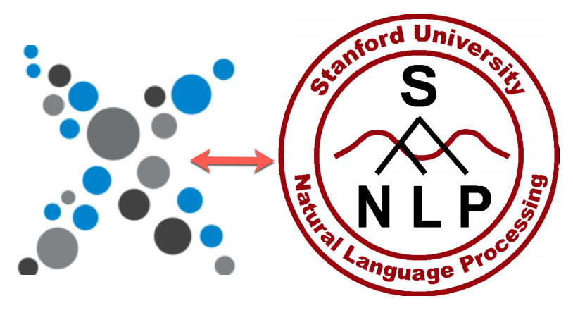

# Stanford CoreNLP Wrapper for eXist-db



This application is a wrapper around the Stanford CoreNLP pipeline.

The base call is:

```xquery
xquery version "3.1";

import module namespace nlp="http://exist-db.org/xquery/stanford-nlp";

let $text := "The fate of Lehman Brothers, the beleaguered investment bank, " ||
             "hung in the balance on Sunday as Federal Reserve officials and " ||
             "the leaders of major financial institutions continued to gather in " ||
             "emergency meetings trying to complete a plan to rescue the stricken " ||
             "bank.  Several possible plans emerged from the talks, held at the " ||
             "Federal Reserve Bank of New York and led by Timothy R. Geithner, " ||
             "the president of the New York Fed, and Treasury Secretary Henry M. Paulson Jr."

let $properties := map { 
                     "annotators" : "tokenize, ssplit, pos, lemma, ner, depparse, coref",
                     "tokenize.language" : "en" 
                   }

return nlp:parse($text, $properties)
```

This returns an XML document of the parsed text.

Any of the properties that refer to files (e.g. ner.model) where the name will be looked 
for as classpath resources or URLs.  The URLs would start with `http://localhost:8080/exist/`
relative to the contents of the database.


There is an XQuery function module that implements Named Entity Recognition that returns the properly
tagged entities within the text.

```xquery
xquery version "3.1";

import module namespace ner = "http://exist-db.org/xquery/stanford-nlp/ner";

let $base := <p>The fate of Lehman Brothers, the beleaguered investment bank, 
                hung in the balance on Sunday as Federal Reserve officials and
                the leaders of major financial institutions continued to gather 
                in emergency meetings trying to complete a plan to rescue the 
                stricken bank.  Several possible plans emerged from the talks, 
                held at the Federal Reserve Bank of New York and led by 
                Timothy R. Geithner, the president of the New York Fed, and 
                Treasury Secretary Henry M. Paulson Jr.</p> 

return ner:classify-node($base)
```

which returns

```xml
<p>The fate of <ORGANIZATION>Lehman Brothers</ORGANIZATION>, the beleaguered investment bank, 
hung in the balance on <DATE>Sunday</DATE> as <ORGANIZATION>Federal Reserve</ORGANIZATION> 
officials and the leaders of major financial institutions continued to gather in emergency 
meetings trying to complete a plan to rescue the stricken bank.  Several possible plans 
emerged from the talks, held at the <ORGANIZATION>Federal Reserve Bank of New York</ORGANIZATION> 
and led by <PERSON>Timothy R. Geithner</PERSON>, the <TITLE>president</TITLE> of the 
<ORGANIZATION>New York Fed</ORGANIZATION>, and <TITLE>Treasury Secretary</TITLE> 
<PERSON>Henry M. Paulson Jr</PERSON>.</p>
```
